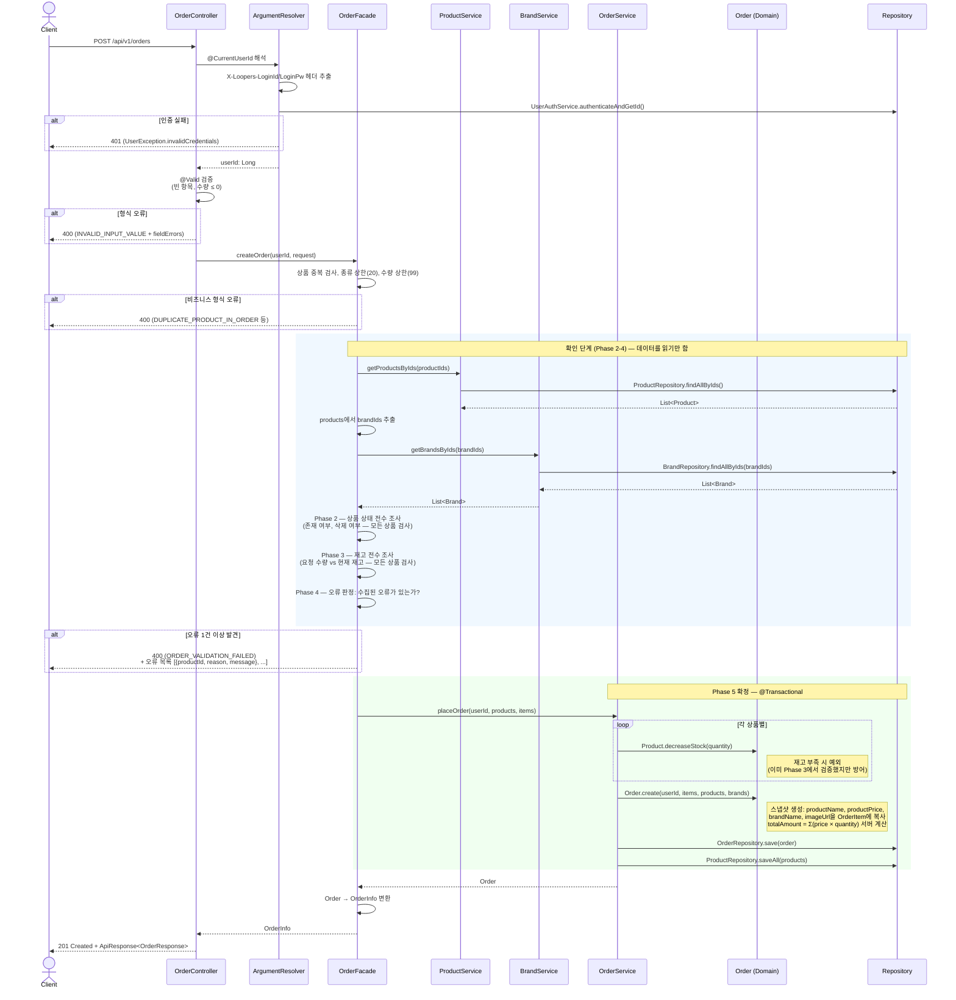
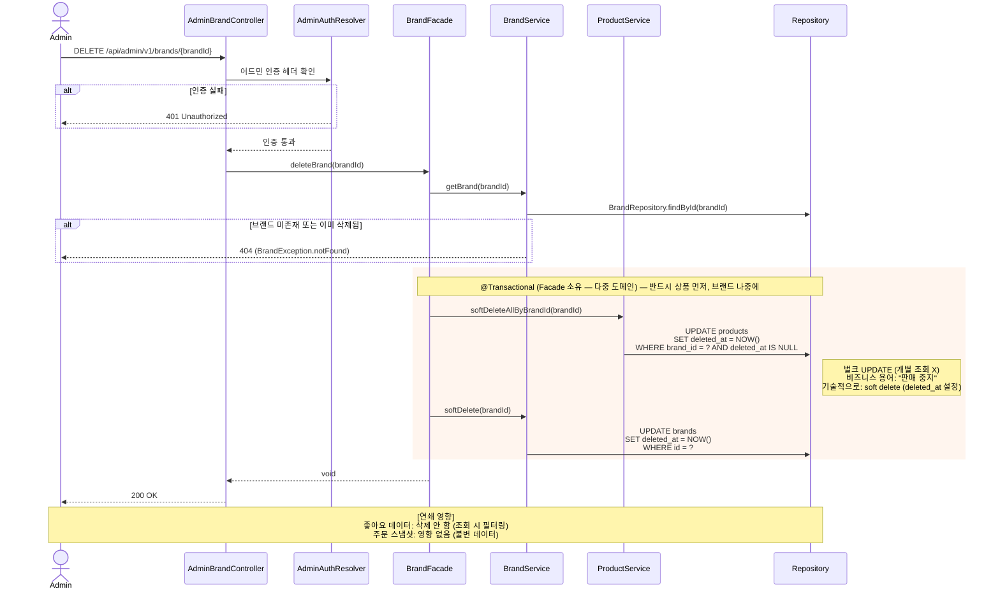
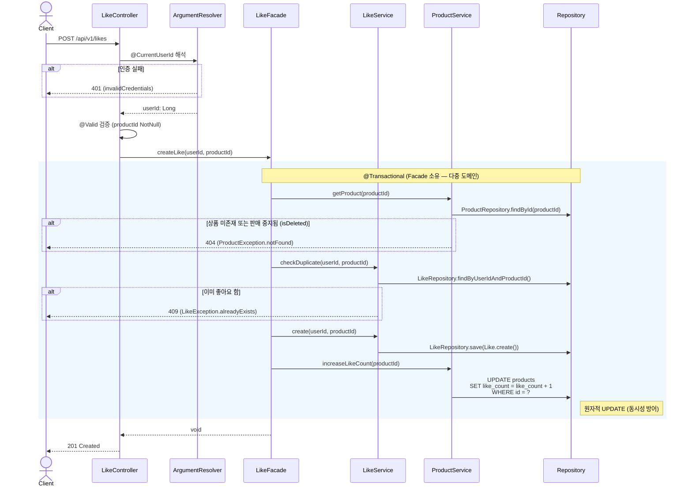
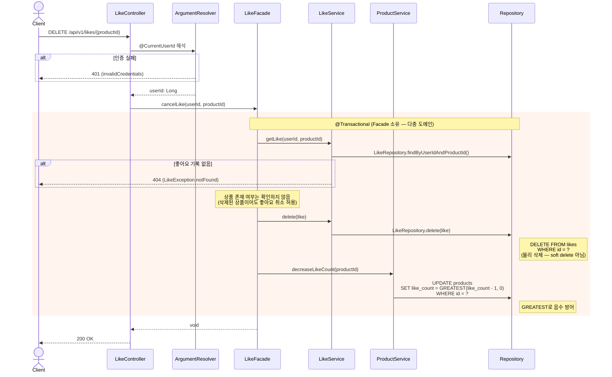

# 개발자용 시퀀스 다이어그램

> **문서 목적**: 구현 전 설계 밑그림입니다. 객체 간 메시지 흐름을 시각화하여 **책임 분리, 호출 순서, 트랜잭션 경계**를 확인합니다.
>
> **독자**: 개발자, 코드 리뷰어
>
> **이 문서로 확인할 수 있는 것**: 누가 무엇을 책임지는가, 어떤 순서로 호출되는가, 트랜잭션이 어디서 시작하고 끝나는가

### 작성 원칙

- 액터는 **도메인/패키지 경계**로 나눕니다 (Controller, Facade, Service, Domain, Repository).
- 기능 하나당 시퀀스 하나를 만듭니다.
- 각 다이어그램은 **배경 → 흐름 → 핵심 포인트** 순서로 구성합니다.

### 공통 레이어 참조

```
Client → Controller → [ArgumentResolver] → Facade → Service → Domain ← Repository
```

| 레이어 | 패키지 | 책임 |
|--------|--------|------|
| Controller | `interfaces/api` | HTTP 계약, `@Valid` 입력 검증, 상태 코드 결정 |
| ArgumentResolver | `interfaces/api/auth` | 인증 헤더 추출 → userId 반환 (트랜잭션 밖) |
| Facade | `application` | 유스케이스 조합, 응답 데이터 준비 |
| Service | `domain` | 도메인 중재, 트랜잭션 경계 |
| Domain | `domain` | 비즈니스 불변식, 엔티티 상태 변경 |
| Repository | `infrastructure` | DB 접근, 쿼리 실행 |

**인증 방식**:
- **고객 API**: `@CurrentUserId` → `CurrentUserIdArgumentResolver` → `X-Loopers-LoginId` / `X-Loopers-LoginPw` 헤더
- **어드민 API**: LDAP 헤더 기반 (고객 인증과 완전 분리)

**트랜잭션 소유 원칙**:
- **단일 도메인 흐름**: Service가 `@Transactional`을 소유합니다 (원칙).
- **다중 도메인 흐름** (좋아요 등록/취소, 브랜드 삭제 등): Facade가 여러 Service를 하나의 흐름으로 조합해야 합니다. 이 경우 Facade에 `@Transactional`을 적용하여 여러 Service 호출을 하나의 트랜잭션으로 묶습니다. Service 메서드는 기본적으로 `@Transactional(propagation = REQUIRED)`이므로 Facade의 트랜잭션에 참여합니다.

---

### 범위

다중 도메인이 엮이거나 트랜잭션 설계가 필요한 흐름만 다룹니다. 단순 CRUD(브랜드 등록/수정, 상품 CRUD)와 단일 도메인 조회(상품 목록, 주문 조회)는 생략합니다.

| # | 흐름 | 다루는 이유 |
|---|------|-----------|
| 1 | 주문 생성 | 3개 도메인(Product, Brand, Order), 전수 조사, 트랜잭션 분리 |
| 2 | 브랜드 삭제 (연쇄) | 2개 도메인(Brand, Product), 벌크 UPDATE, 실행 순서 |
| 3 | 좋아요 등록 | 2개 도메인(Like, Product), 인기도 동기화 |
| 4 | 좋아요 취소 | 2개 도메인(Like, Product), hard delete, 음수 방어 |

---

## 1. 주문 생성

### 배경

Product, Brand, Order **3개 도메인**이 하나의 흐름에서 엮이고, 확인(읽기)과 확정(쓰기)에서 트랜잭션 경계가 달라집니다.

- 검증 책임이 Controller(`@Valid`)와 Facade(비즈니스 검증) 사이에 나뉩니다.
- 전수 조사의 에러 수집이 일반적인 fail-fast와 다르므로, 구현 시 주의가 필요합니다.
- 트랜잭션은 확정 단계(Phase 5)에만 걸립니다.

### 흐름



### 핵심 포인트

**책임 분리:**
- Controller는 `@Valid`로 필수/형식 검증만 담당합니다. 빈 항목, 수량 음수 등이 해당됩니다.
- Facade는 비즈니스 형식 검증(중복 상품, 상한) + 전수 조사 오케스트레이션 + 응답 변환을 담당합니다.
- Service는 `@Transactional` 경계 안에서 재고 차감, 주문 생성, 저장을 담당합니다.
- Domain은 `Product.decreaseStock()`, `Order.create()` — 비즈니스 불변식을 엔티티가 스스로 지킵니다.

**호출 순서:**
- 인증(ArgumentResolver) → 형식 검증(Controller) → 비즈니스 검증(Facade) → 확정(Service) 순서로 진행됩니다. 앞 단계를 통과해야 다음 단계로 진행합니다.

**트랜잭션 경계:**
- Phase 2-4(읽기)는 트랜잭션 밖에서 실행 가능합니다. Phase 5(쓰기)만 `@Transactional`로 묶습니다.
- 재고 차감 + 스냅샷 생성 + 주문 저장이 하나의 트랜잭션에서 원자적으로 처리됩니다.

**구현 시 참고:**
- **N+1 방지**: `findAllByIds()`로 상품과 브랜드를 각각 한 번에 조회합니다. 상품별/브랜드별 개별 쿼리 호출은 금지입니다.
- **전수 조사 구현**: Phase 2-3에서 에러 발견 시 바로 throw하지 않고 List에 수집한 뒤, 모든 상품 검사 후 일괄 반환합니다.
- **스냅샷 생성 위치**: `Order.create()` 또는 `OrderItem.create()` 도메인 메서드 내부에서 처리합니다.
- **금액 계산 주체**: `Order.calculateTotalAmount()`가 도메인 내부에서 계산합니다. 클라이언트 전달값은 무시합니다.

**검증 책임과 도메인 원칙:**
- Phase 2-3의 전수 조사에서는 Facade가 상품 상태(isDeleted)와 재고(stock)를 직접 읽고 오류를 수집합니다. 도메인 메서드(`decreaseStock()`)는 예외를 즉시 throw하므로 "모든 오류를 수집"하는 전수 조사 패턴과 맞지 않기 때문입니다.
- Phase 5의 확정 단계에서는 `Product.decreaseStock()`이 재고 부족 시 예외를 throw합니다. 이미 Phase 3에서 검증했지만, Phase 3~5 사이의 시간차를 방어하는 **이중 안전장치** 역할입니다. 도메인 불변식은 확정 단계에서 엔티티가 스스로 지킵니다.

---

## 2. 브랜드 삭제 (연쇄 삭제)

### 배경

2개 도메인(Brand, Product)에 걸친 연쇄 삭제입니다.

- 상품 → 브랜드 순서를 지켜야 데이터 일관성이 보장됩니다.
- 두 UPDATE가 하나의 트랜잭션에서 원자적으로 처리되어야 합니다.
- 좋아요 데이터는 의도적으로 건드리지 않습니다 (조회 시 필터링으로 처리).

### 흐름



### 핵심 포인트

**책임 분리:**
- Facade는 삭제 순서 오케스트레이션을 담당합니다 (상품 먼저 → 브랜드 나중에).
- ProductService는 소속 상품 벌크 soft delete(= 비즈니스 용어로 "판매 중지")를 담당합니다.
- BrandService는 브랜드 존재 확인 + soft delete를 담당합니다.
- Like 관련 Service는 **호출하지 않습니다** (의도적). 좋아요 데이터는 조회 시 필터링으로 처리합니다.

**호출 순서:**
- 상품 soft delete → 브랜드 soft delete 순서입니다. 순서가 반대면 "브랜드 없는 활성 상품"이 일시적으로 존재하게 됩니다.

**트랜잭션 경계:**
- 상품 벌크 UPDATE + 브랜드 UPDATE가 하나의 `@Transactional` 안에서 처리됩니다. 하나라도 실패하면 전부 롤백됩니다.

**구현 시 참고:**
- **벌크 UPDATE**: 소속 상품을 개별 조회하지 않고, WHERE 조건으로 일괄 soft delete합니다.
- **이미 삭제된 브랜드 재삭제**: 404를 반환합니다 (삭제된 리소스는 존재하지 않는 것으로 간주합니다).

---

## 3. 좋아요 등록

### 배경

2개 도메인(Like, Product)이 하나의 트랜잭션에서 동기화되어야 합니다. 좋아요 저장과 인기도 증가가 분리되면 데이터 불일치가 발생합니다.

- 상품 존재 확인 → 중복 체크 → 저장 → 인기도 동기화 순서가 중요합니다.
- Like 저장과 Product.likeCount 증가가 같은 트랜잭션이어야 합니다.
- 중복 방어는 애플리케이션 레벨 검증 + DB UNIQUE 제약으로 이중 처리합니다.

### 흐름



### 핵심 포인트

**책임 분리:**
- Facade는 검증 순서 오케스트레이션을 담당합니다 (상품 확인 → 중복 체크 → 저장 → 인기도 동기화).
- ProductService는 상품 존재 및 판매 중지 여부 확인(`isDeleted()`) + 인기도(likeCount) 원자적 증가를 담당합니다.
- LikeService는 중복 체크 + Like 엔티티 생성/저장을 담당합니다.
- Domain은 `Like.create()` 팩토리 메서드를 통해 엔티티를 생성합니다.

**호출 순서:**
- 상품 존재 확인 → 중복 좋아요 확인 순서입니다. 존재하지 않는 상품에 대한 중복 체크는 불필요한 쿼리이므로 상품 확인이 먼저 실행됩니다.

**트랜잭션 경계:**
- Like 저장 + Product.likeCount 증가가 같은 `@Transactional` 안에서 처리됩니다. "좋아요는 됐는데 인기도는 안 올라가는" 불일치를 방지합니다.

**구현 시 참고:**
- **likeCount 원자적 UPDATE**: `SET like_count = like_count + 1`로 DB 레벨에서 원자적으로 증가시킵니다. 애플리케이션에서 읽고 +1 후 저장하면 동시 요청 시 lost update가 발생합니다.
- **이중 안전장치**: `UNIQUE(user_id, product_id)` DB 제약 + 애플리케이션 레벨 검증을 병행합니다. 레이스 컨디션을 방어합니다.

---

## 4. 좋아요 취소

### 배경

등록의 역방향이지만 **hard delete** + **삭제된 상품에 대한 취소 허용**이라는 차이가 있습니다.

- 등록과 달리 상품 존재 확인을 하지 않습니다 (삭제된 상품이어도 취소 허용).
- soft delete가 아닌 물리 삭제(hard delete)입니다.
- likeCount 음수 방어는 DB 레벨(`GREATEST`)에서 처리합니다.

### 흐름



### 핵심 포인트

**책임 분리:**
- Facade는 취소 흐름 오케스트레이션을 담당합니다 (좋아요 확인 → 삭제 → 인기도 동기화).
- LikeService는 좋아요 존재 확인 + 물리 삭제를 담당합니다.
- ProductService는 인기도(likeCount) 원자적 감소를 담당합니다 (음수 방어 포함).

**호출 순서 — 등록과의 차이:**
- **등록**: 상품 존재 확인 → 중복 체크 → 저장 → 인기도 +1
- **취소**: 좋아요 존재 확인 → 삭제 → 인기도 -1. **상품 존재 확인이 없습니다.**
- 이유: 상품이 판매 중지되었더라도 "내 좋아요 목록에서 제거"하는 것은 자연스러운 행위이기 때문입니다.

**트랜잭션 경계:**
- Like 삭제 + Product.likeCount 감소가 같은 `@Transactional` 안에서 처리됩니다. "좋아요는 취소됐는데 인기도는 안 줄어드는" 불일치를 방지합니다.

**구현 시 참고:**
- **Hard Delete**: `LikeRepository.delete()` — soft delete가 아닌 물리 삭제입니다. 법적 보존 의무가 없고, 등록/취소가 빈번하여 레코드 누적을 방지합니다.
- **likeCount 음수 방어**: `GREATEST(like_count - 1, 0)`으로 DB 레벨에서 최소값 0을 보장합니다. 동시성 버그로 인한 음수를 방지합니다.
