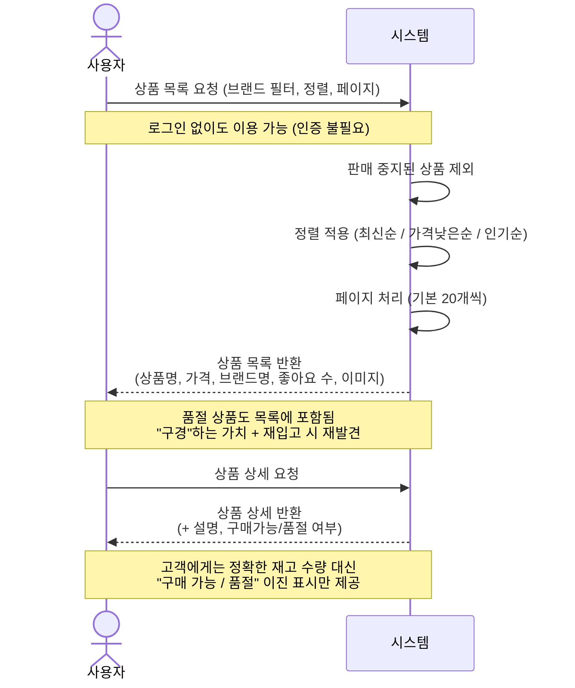
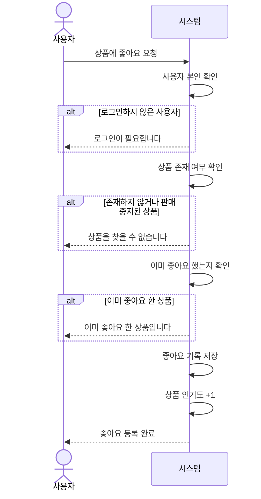
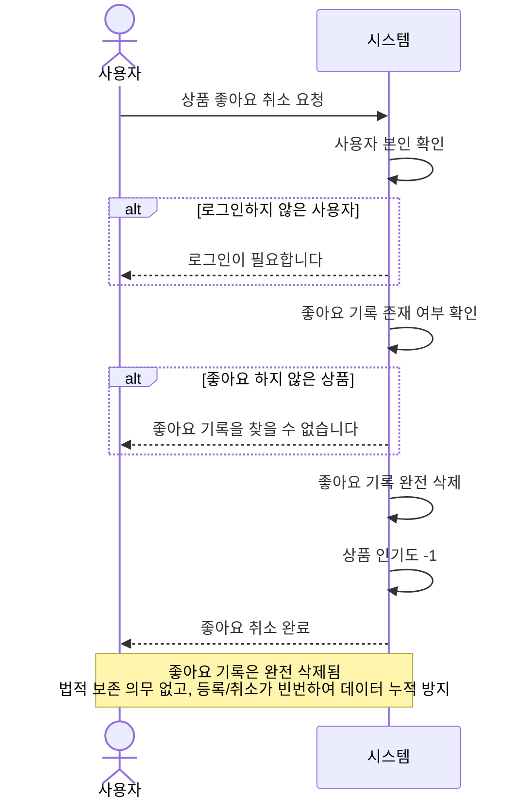
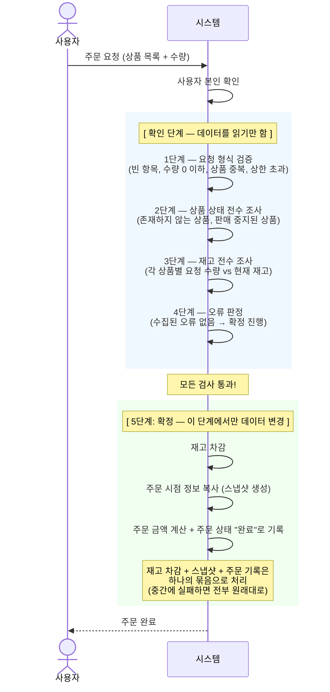
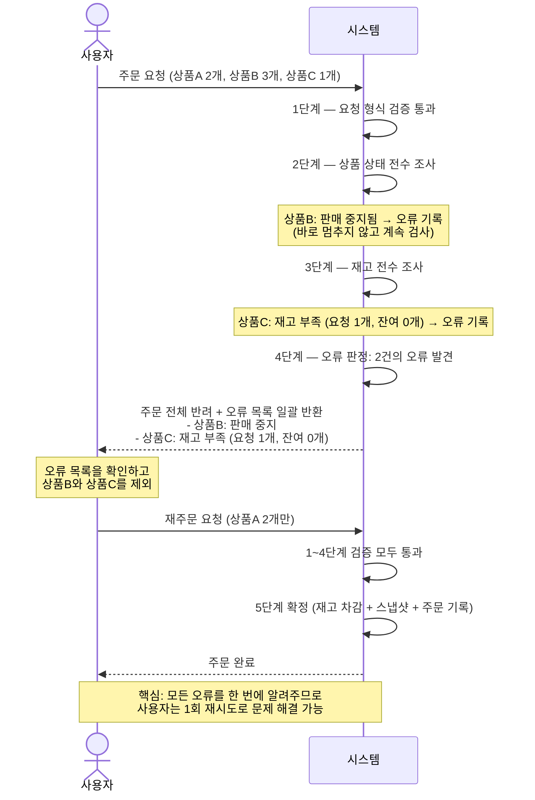
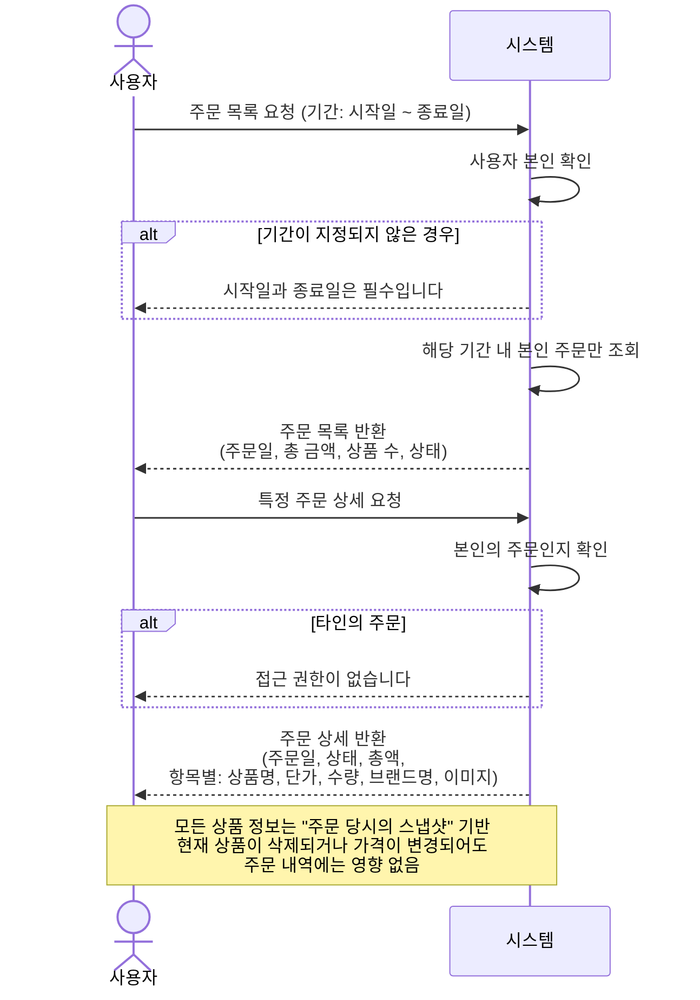
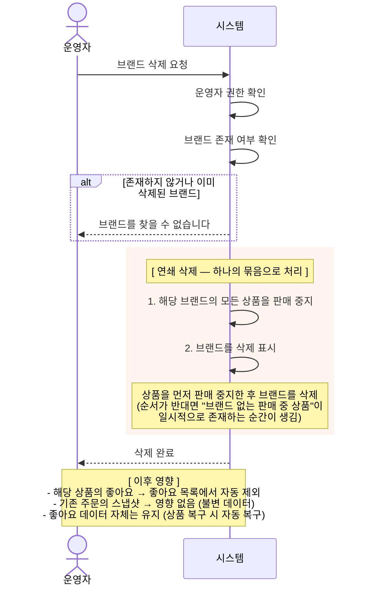

# 비즈니스 흐름 시퀀스 다이어그램

> **문서 목적**: 핵심 비즈니스 흐름을 시각화하여, "시스템이 어떻게 동작해야 하는가"에 대한 팀 전체의 합의를 형성합니다.
>
> **독자**: PM, 기획자, 디자이너, 개발자 — 모든 직군이 함께 봅니다.
>
> **이 문서로 확인할 수 있는 것**: 기능 흐름의 정확성, 정책 결정이 실제 사용자 경험에 어떻게 반영되는지

### 작성 원칙

- 액터는 **사용자 / 시스템 / 운영자** 3가지만 사용합니다.
- 기술 용어(Controller, Service, DB, HTTP 상태코드 등)를 사용하지 않습니다.
- 각 다이어그램은 **배경 → 흐름 → 핵심 포인트** 순서로 구성합니다.

### 선정 기준

"우리 서비스만의 정책 결정이 드러나는 흐름"만 골랐습니다. 단순 CRUD(브랜드 등록, 상품 수정 등)는 별도 다이어그램 없이 요구사항 명세서의 동작 규칙으로 충분합니다.

| # | 흐름 | 드러나는 정책 |
|---|------|-------------|
| 1 | 상품 탐색 | 품절 노출(정책 10), 재고 이진 표시(정책 22), 정렬 기본값(정책 26) |
| 2 | 좋아요 등록 | 중복 시 에러 반환(정책 13), 인기도 즉시 반영(정책 15) |
| 3 | 좋아요 취소 | 즉시 삭제(정책 12), 삭제 상품에도 취소 허용 |
| 4 | 주문 생성 (성공) | 확인/확정 분리, 전수 조사(정책 2), 스냅샷(정책 3), 서버 금액 계산(정책 28) |
| 5 | 주문 생성 (실패→재시도) | 전체 반려(정책 1), 전수 조사+일괄 통보(정책 2) |
| 6 | 주문 조회 | 스냅샷 기반 응답(정책 3), 기간 필수(정책 6), 접근 제어(정책 20) |
| 7 | 어드민: 브랜드 삭제 | 연쇄 삭제(정책 9), 좋아요 유지+필터링(정책 14) |

---

## 1. 상품 탐색

### 배경

사용자가 상품을 찾는 가장 기본적인 흐름입니다. 단순해 보이지만, **"품절 상품도 보여준다"**와 **"재고 수량은 숨긴다"**라는 두 가지 정책이 사용자 화면에 직접 영향을 줍니다.

### 흐름

### 핵심 포인트

- **인증 불필요**: 상품 탐색은 비로그인 사용자도 이용할 수 있습니다. "일단 구경부터" 가능한 서비스를 지향하기 때문입니다. 좋아요, 주문 등 "내 행동을 기록"하는 기능만 로그인을 요구합니다.
- **품절 상품도 노출**: 재고 0인 상품이 목록에서 사라지지 않습니다. 감성 이커머스 특성상 브랜드의 전체 라인업을 탐색하는 것 자체에 가치가 있습니다. (→ 정책 10)
- **재고는 이진 표시**: 고객에게 "3개 남음" 같은 수량을 보여주지 않습니다. "구매 가능" 또는 "품절"만 표시합니다. (→ 정책 22)
- **정렬 기본값**: 아무것도 지정하지 않으면 최신순입니다. 새로 등록된 상품이 먼저 보입니다. (→ 정책 26)
- **판매 중지 상품 제외**: 품절과 판매 중지는 다릅니다. 품절은 재입고 가능성이 있어 노출하지만, 판매 중지(삭제)된 상품은 목록에서 완전히 제외합니다.

---

## 2. 좋아요 등록

### 배경

좋아요는 단순해 보이지만, **"이미 좋아요한 상품에 다시 요청하면 에러를 반환한다"**는 정책이 사용자 화면 설계에 직접 영향을 줍니다. 프론트엔드가 중복 요청 시 에러 처리를 어떻게 할지 사전 합의가 필요합니다.

### 흐름

### 핵심 포인트

- **중복 시 에러 반환**: 사용자 화면에서는 하트가 토글로 동작하지만, 시스템 내부에서는 등록과 취소가 별도 요청입니다. 이미 좋아요 상태에서 또 등록을 시도하면 "이미 등록됨"을 명시적으로 알려줍니다. 조용히 성공 처리하면 버그를 감추게 됩니다. (→ 정책 13)
- **인기도 즉시 반영**: 좋아요 저장과 인기도 증가가 하나의 묶음으로 처리됩니다. "좋아요는 됐는데 인기순 정렬에는 반영이 안 되는" 상황이 발생하지 않습니다. (→ 정책 15)
- **판매 중지 상품 방어**: 이미 판매 중지된 상품에는 새로운 좋아요를 등록할 수 없습니다.

---

## 3. 좋아요 취소

### 배경

좋아요 취소는 등록의 역방향이지만, **데이터를 완전히 삭제한다**는 점과 **판매 중지된 상품이어도 취소할 수 있다**는 점에서 등록과 다른 흐름을 가집니다.

### 흐름

### 핵심 포인트

- **완전 삭제**: 좋아요 취소 시 "취소됨" 표시가 아니라 기록 자체를 제거합니다. 좋아요는 거래 기록이 아니므로 보존할 이유가 없고, 등록/취소가 빈번하여 데이터 누적을 방지합니다. (→ 정책 12)
- **인기도 최소 0 보장**: 인기도가 음수가 되지 않도록 방어합니다.
- **판매 중지 상품이어도 취소 가능**: 상품이 판매 중지되었더라도 "내 좋아요 목록에서 빼는" 행위는 자연스럽습니다. 등록은 막지만 취소는 허용합니다.

---

## 4. 주문 생성 (성공)

### 배경

주문 생성은 이 서비스에서 가장 복잡한 기능입니다. **"확인 단계에서는 데이터를 읽기만 하고, 확정 단계에서만 데이터를 변경한다"**는 구조가 핵심이며, **스냅샷 생성**이 정확히 어느 시점에 일어나는지가 중요합니다.

### 흐름

### 핵심 포인트

- **확인과 확정의 분리**: 1~4단계(확인)에서는 데이터를 읽기만 하고, 5단계(확정)에서만 데이터를 변경합니다. 검증 도중에 실수로 재고가 차감되는 사고를 원천 방지하고, 향후 동시 접근 제어가 필요할 때 "제어가 필요한 구간"을 5단계로 한정할 수 있습니다.
- **전수 조사**: 문제가 발견되어도 바로 멈추지 않고 모든 상품을 검사합니다. 실패 시 어떤 일이 일어나는지는 다음 다이어그램(5번)에서 다룹니다. (→ 정책 2)
- **스냅샷**: 주문 시점의 상품명, 가격, 브랜드명을 복사하여 저장합니다. 이후 원본이 변경/삭제되어도 주문 내역은 불변입니다. (→ 정책 3)
- **주문 금액은 서버 계산**: 클라이언트가 보내는 것은 상품 ID와 수량뿐입니다. 금액은 서버가 직접 계산합니다. (→ 정책 28)

---

## 5. 주문 생성 (실패 → 재시도)

### 배경

주문이 실패했을 때, 사용자가 "무엇이 왜 실패했는지"를 한 번에 파악하고 한 번의 재시도로 해결할 수 있어야 합니다. **"전수 조사 + 일괄 통보 + 전체 반려"** 정책이 이 경험을 어떻게 만들어내는지가 핵심입니다.

### 흐름

### 핵심 포인트

- **전수 조사의 실제 효과**: 상품B에서 문제를 발견해도 멈추지 않고 상품C까지 검사합니다. 두 가지 문제를 한 번에 알려줍니다. (→ 정책 2)
- **1회 재시도 원칙**: 오류를 하나씩 알려주면 사용자의 재시도 피로도가 급격히 높아집니다. 재시도 사이에 다른 상품마저 품절될 위험도 있습니다.
- **전체 반려**: 하나라도 문제가 있으면 주문 전체가 거부됩니다. 현재 취소/환불 기능이 없으므로 부분 주문을 허용하면 "3개는 배송, 2개는 취소해야 하는데 취소할 방법이 없는" 상황이 생깁니다. (→ 정책 1)
- **프론트엔드 관점**: 에러 응답에는 상품별로 무엇이 왜 문제인지가 포함됩니다. 이를 사용자에게 목록 형태로 보여주면 됩니다.

---

## 6. 주문 조회

### 배경

주문 내역은 "주문 당시의 정보"를 보여줘야 합니다. 상품이 삭제되거나 가격이 변경되어도 주문 내역에는 영향이 없어야 합니다. 이 요구사항이 **스냅샷 기반 응답**이라는 설계로 이어집니다.

### 흐름

### 핵심 포인트

- **스냅샷 기반 응답**: 주문 상세를 보여줄 때 현재 상품 정보를 조회하지 않습니다. 주문 확정 시 저장해둔 복사본만으로 응답을 구성합니다. 예를 들어 주문 후 가격이 올랐더라도, 주문 내역에는 구매 당시 가격이 보입니다. (→ 정책 3)
- **기간 필수**: 주문 목록 조회 시 시작일~종료일은 반드시 지정해야 합니다. "기본 3개월" 같은 암묵적 조건을 두지 않고, 클라이언트가 항상 의도를 명시합니다. (→ 정책 6)
- **접근 제어**: 타인의 주문 ID를 알더라도 접근할 수 없습니다. 본인 주문만 조회 가능합니다. (→ 정책 20)

---

## 7. 어드민: 브랜드 삭제 (연쇄 삭제)

### 배경

브랜드 삭제는 단순한 삭제가 아닙니다. 브랜드를 삭제하면 소속 상품도 함께 판매 중지되고, 좋아요 목록의 노출도 달라집니다. **연쇄 영향의 범위**와 함께 **"영향받지 않는 것"**도 중요합니다.

### 흐름

### 핵심 포인트

- **상품 먼저, 브랜드 나중에**: 상품을 먼저 판매 중지한 후 브랜드를 삭제합니다. 순서를 지켜야 "브랜드는 없는데 상품은 판매 중"이라는 불일치가 생기지 않습니다.
- **좋아요는 건드리지 않음**: 좋아요 데이터 자체를 삭제하지 않고, 좋아요 목록 조회 시 판매 중지된 상품을 자동으로 제외합니다. 향후 브랜드/상품이 복구되면 좋아요도 별도 작업 없이 자동 복구됩니다. (→ 정책 14)
- **주문 스냅샷 무관**: 이미 생성된 주문의 스냅샷에는 영향 없습니다. 주문 당시 정보가 그대로 보존됩니다. (→ 정책 3)
- **소프트 삭제**: 실제로 데이터를 지우지 않고 '삭제됨' 표시만 남깁니다. 실수로 삭제해도 복구 가능합니다. (→ 정책 9)

---

## 전체 요약

| # | 흐름 | 핵심 포인트 | 관련 정책 |
|---|------|-----------|----------|
| 1 | 상품 탐색 | 품절 상품도 노출, 재고는 이진 표시, 정렬 기본값 최신순 | 10, 22, 26 |
| 2 | 좋아요 등록 | 중복 시 에러 반환, 인기도 즉시 반영 | 13, 15 |
| 3 | 좋아요 취소 | 데이터 완전 삭제, 인기도 최소 0 보장 | 12 |
| 4 | 주문 생성 (성공) | 확인/확정 분리, 전수 조사, 스냅샷 생성, 서버 금액 계산 | 2, 3, 28 |
| 5 | 주문 생성 (실패→재시도) | 오류 일괄 통보, 1회 재시도 원칙, 전체 반려 | 1, 2 |
| 6 | 주문 조회 | 스냅샷 기반 응답, 기간 필수, 타인 접근 불가 | 3, 6, 20 |
| 7 | 어드민: 브랜드 삭제 | 연쇄 삭제, 좋아요 유지+필터링, 스냅샷 무관 | 9, 14 |
