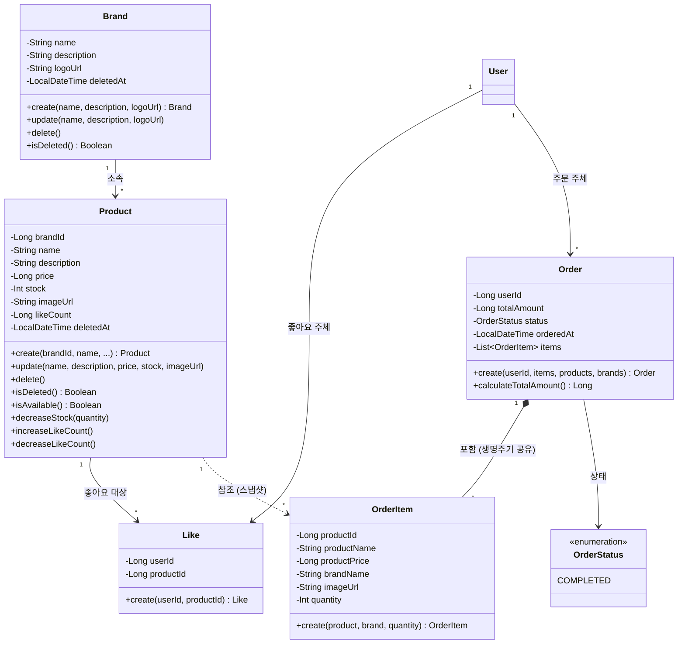

# 도메인 객체 설계 (클래스 다이어그램)

> **문서 목적**: 도메인 객체의 **책임(메서드)**과 객체 간 **의존 방향**, **응집도**를 시각화합니다.
>
> **독자**: 개발자, 코드 리뷰어
>
> **이 문서로 확인할 수 있는 것**: 각 객체가 무엇을 할 수 있는가, 객체 간 결합도가 낮은가, 관련 없는 책임이 섞여 있지 않은가
>
> **관련 문서**: 데이터 저장 구조(테이블, 컬럼, 인덱스)는 [04-erd.md](./04-erd.md)에서 확인할 수 있습니다.

---

## 1. 클래스 다이어그램

### 배경

ERD만으로는 "이 객체가 무엇을 **할 수 있는가**"를 알 수 없습니다. 클래스 다이어그램은 각 도메인 객체의 **책임(메서드)**과 객체 간 **의존 방향**, **응집도**를 확인하기 위해 그렸습니다.

**이 다이어그램에서 확인할 것:**
1. 비즈니스 행위(재고 차감, 인기도 증감, 스냅샷 생성)가 어떤 객체에 있는가 (도메인 책임)
2. 객체 간 참조가 ID로만 이루어져 결합도가 낮은가 (의존 방향)
3. 하나의 객체에 관련 없는 책임이 섞여 있지 않은가 (응집도)

### 다이어그램

### 핵심 포인트

**도메인 책임 — "이 객체가 무엇을 할 수 있는가":**

- **Product.decreaseStock(quantity)**: 재고 차감은 Service가 아니라 Product 엔티티 스스로 수행합니다. "재고가 충분한가?"라는 불변식을 엔티티 내부에서 검증합니다.
- **Product.isAvailable()**: 고객에게 "구매 가능 / 품절"을 표시하기 위한 메서드입니다. `stock > 0`이면 구매 가능, 아니면 품절입니다. `isDeleted()`와는 별개의 판단입니다 — 삭제된 상품은 조회 자체가 안 되므로, 이 메서드는 활성 상품 내에서의 구매 가능 여부만 판단합니다. (→ 정책 22)
- **Product.increaseLikeCount() / decreaseLikeCount()**: 인기도 증감도 Product의 책임입니다. 인기도가 음수가 되지 않도록 방어하는 것도 도메인 규칙입니다.
- **Order.create(userId, items, products, brands)**: 주문 생성 시 Product/Brand 정보를 받아 스냅샷(OrderItem)을 생성하고 금액을 계산합니다. Product/Brand 조회는 Service가 담당하고, 스냅샷 생성과 금액 계산은 Order가 담당합니다.
- **Order.calculateTotalAmount()**: 주문 총액을 서버에서 계산하는 로직이 도메인에 위치합니다.

**의존 방향 — "ID로만 연결된다":**

- **Product → brandId(Long)**: Product는 Brand 엔티티를 직접 참조하지 않고 brandId만 보유합니다. 목록 조회 시 brandName이 필요하면 인프라 레이어에서 JOIN으로 해결합니다.
- **Like → userId, productId**: Like도 User/Product를 직접 참조하지 않습니다. 도메인 간 결합도를 최소화합니다.

**관계 — 선의 종류에 주목:**

| 선 | 의미 | 예시 |
|----|------|------|
| 실선 화살표 (`-->`) | 직접 연관 | Brand → Product (소속) |
| 합성 (`*--`) | 생명주기 공유 | Order *-- OrderItem (Order 없이 OrderItem 무의미) |
| 점선 (`..>`) | 느슨한 참조 | Product ..> OrderItem (Product 삭제돼도 OrderItem은 스냅샷으로 독립) |

**설계 결정:**

- **OrderItem이 Product를 직접 참조하지 않고 스냅샷을 저장하는 이유**: 주문 후 상품의 이름, 가격, 브랜드가 변경되거나 삭제되더라도 주문 내역은 "주문 당시의 정보"를 보여줘야 합니다. Product → OrderItem은 점선(참조용)이며, OrderItem은 자체적으로 productName, productPrice, brandName을 보유합니다. (→ 정책 3)

- **likeCount가 Product에 있는 이유**: 좋아요 수 기반 정렬(인기순)을 위해, 매번 Like 테이블을 COUNT하는 대신 Product에 likeCount를 직접 관리합니다(반정규화). 동시성 이슈는 이후 고도화에서 해결합니다. (→ 정책 15)

- **Like에 deletedAt이 없는 이유**: 좋아요 취소 시 물리 삭제(hard delete)합니다. 법적 보존 의무가 없고, 등록/취소가 빈번하여 soft delete로 레코드를 쌓으면 데이터가 빠르게 증가합니다. (→ 정책 12)

- **OrderStatus가 현재 COMPLETED 하나인 이유**: 결제 기능이 없으므로 주문 = 즉시 확정입니다. 이후 결제 연동 시 PENDING, PAID, CANCELLED 등으로 확장할 수 있도록 enum으로 설계해두었습니다.

**이 다이어그램에 포함하지 않은 것:**
- `id`, `createdAt`, `updatedAt`: 모든 엔티티의 공통 인프라 필드입니다. BaseEntity에서 상속받으며, 도메인 행위와 무관합니다.
- `deletedAt`: Brand, Product에만 표기했습니다. soft delete 여부가 비즈니스 로직(isDeleted())에 영향을 주기 때문입니다. Like, Order, OrderItem은 soft delete를 사용하지 않으므로 생략했습니다.
- User: Round 1에서 이미 설계/구현된 도메인 객체입니다. 관계선에서만 참조하고, 이 다이어그램에서 클래스 정의는 생략했습니다.
- Repository, Service: 클래스 다이어그램은 도메인 모델만 다룹니다. 호출 흐름은 시퀀스 다이어그램에서 확인할 수 있습니다.

---

## 2. 관계 요약

| 관계 | 설명 | 비고 |
|------|------|------|
| Brand 1 : N Product | 하나의 브랜드에 여러 상품이 속합니다 | 브랜드 삭제 시 연쇄 soft delete |
| Product 1 : N Like | 하나의 상품에 여러 좋아요가 가능합니다 | 취소 시 hard delete |
| User 1 : N Like | 한 사용자가 여러 상품에 좋아요할 수 있습니다 | UNIQUE(user_id, product_id) |
| User 1 : N Order | 한 사용자가 여러 주문을 할 수 있습니다 | 타 유저 주문 접근 불가 (→ 정책 20) |
| Order 1 : N OrderItem | 하나의 주문에 여러 항목이 포함됩니다 | 생명주기 공유 (합성 관계) |
| Product 1 : N OrderItem | 참조용입니다 (스냅샷과 별개) | product_id는 추적용, 논리적 FK 아님 |
