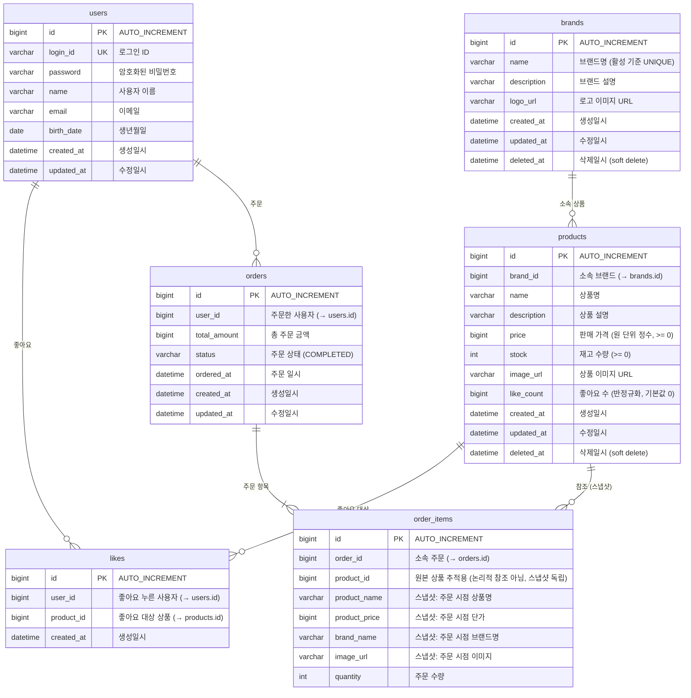

# ERD (Entity-Relationship Diagram)

> **문서 목적**: 데이터가 **어떻게 저장되는가** — 테이블 구조, 컬럼 타입, 참조 관계, 인덱스를 정의합니다.
>
> **독자**: 개발자, DBA, 코드 리뷰어
>
> **이 문서로 확인할 수 있는 것**: 영속성 구조, 참조 관계와 무결성 전략, 정규화/반정규화 결정, 인덱스 설계
>
> **관련 문서**: 도메인 객체의 책임과 메서드는 [03-class-diagram.md](./03-class-diagram.md)에서 확인할 수 있습니다.

---

## 1. ERD

### 배경

클래스 다이어그램이 "객체가 무엇을 하는가"를 보여준다면, ERD는 "데이터가 어떻게 저장되는가"를 보여줍니다. **영속성 구조, 참조 관계, 정규화/반정규화 결정**을 확인하기 위해 그렸습니다.

**이 다이어그램에서 확인할 것:**
1. 각 테이블의 컬럼 타입과 제약 조건이 비즈니스 규칙과 일치하는가 (영속성 구조)
2. 참조 컬럼이 올바른 테이블에 있는가, 의도적으로 FK 제약을 걸지 않은 이유는 무엇인가 (참조 관계)
3. likeCount 반정규화, 스냅샷 비정규화가 의도적인가 (정규화 여부)

### 다이어그램

### 핵심 포인트

**영속성 구조:**

- **price가 bigint인 이유**: 원 단위 정수로 저장하여 부동소수점 연산 오류를 방지합니다. 소수점 금액이 필요 없는 한국 원화 기반 서비스에 적합합니다. (→ 정책 29)
- **likes 테이블에 deleted_at이 없는 이유**: 좋아요 취소 시 물리적으로 삭제(hard delete)합니다. 등록/취소가 빈번하여 soft delete를 적용하면 데이터가 빠르게 누적됩니다. (→ 정책 12)
- **orders 테이블에 deleted_at이 없는 이유**: 주문은 거래 기록이므로 삭제하지 않습니다. 추후 취소 기능이 추가되어도 status를 CANCELLED로 변경하는 방식으로 처리합니다.
- **order_items 테이블에 created_at/updated_at이 없는 이유**: 주문 항목은 주문 확정 시 생성되고 이후 변경되지 않는 불변 스냅샷입니다. 생성 시점은 소속 주문의 `ordered_at`으로 충분히 추적 가능하며, 수정 자체가 발생하지 않으므로 `updated_at`도 불필요합니다.

**참조 관계 (DB FK 제약 없음):**

이 ERD에서 모든 참조 컬럼(`brand_id`, `user_id`, `product_id`, `order_id`)에 **DB 레벨 FK 제약을 걸지 않습니다.** 논리적 관계는 존재하지만, 참조 무결성은 애플리케이션 레벨에서 보장합니다.

DB FK 제약을 사용하지 않는 이유:
- FK 체크로 인한 INSERT/UPDATE/DELETE 성능 오버헤드를 방지합니다.
- 스키마 변경(테이블 수정, 마이그레이션) 시 FK가 방해되지 않습니다.
- 향후 서비스 분리(MSA) 시 DB 간 FK는 불가능하므로, 처음부터 애플리케이션 레벨 검증에 익숙해지는 것이 유리합니다.

참조 컬럼별 성격:

| 컬럼 | 참조 대상 | 성격 | 무결성 보장 |
|------|----------|------|-----------|
| `products.brand_id` | brands.id | 논리적 참조 | Service에서 브랜드 존재 확인 후 저장 |
| `likes.user_id` | users.id | 논리적 참조 | ArgumentResolver에서 인증 시 확인 |
| `likes.product_id` | products.id | 논리적 참조 | Service에서 상품 존재 확인 후 저장 |
| `orders.user_id` | users.id | 논리적 참조 | ArgumentResolver에서 인증 시 확인 |
| `order_items.order_id` | orders.id | 논리적 참조 | Order와 함께 생성되므로 항상 유효 |
| `order_items.product_id` | products.id | **추적용 (스냅샷 독립)** | 검증하지 않음 — 원본 삭제와 무관하게 스냅샷은 독립 |

`order_items.product_id`만 성격이 다릅니다. 나머지 5개는 "논리적으로는 FK이지만 DB 제약을 걸지 않는 것"이고, 이 컬럼은 **애초에 논리적으로도 FK가 아닙니다.** 스냅샷은 원본과 의도적으로 분리된 데이터이며, 원본 상품이 삭제되어도 주문 기록은 독립적으로 존재해야 하기 때문입니다. (→ 정책 3)

**정규화 여부:**

- **products.like_count (반정규화)**: 정규화 원칙대로라면 `SELECT COUNT(*) FROM likes WHERE product_id = ?`로 계산해야 합니다. 하지만 인기순 정렬이 빈번하므로, 매 조회마다 COUNT하는 대신 Product에 직접 관리합니다. 좋아요 등록/취소 시 +1/-1로 동기화합니다. (→ 정책 15)
- **order_items의 스냅샷 필드 (비정규화)**: product_name, product_price, brand_name, image_url은 products 테이블의 데이터와 중복입니다. 하지만 주문 시점 정보를 보존해야 하므로 의도적으로 비정규화했습니다. (→ 정책 3)
- **like_count의 기본값이 0인 이유**: 상품 생성 시 좋아요가 없으므로 0에서 시작합니다. 이 값은 좋아요 등록/취소 시 +1/-1로 동기화됩니다.

---

## 2. 인덱스 & 제약조건

| 테이블 | 인덱스/제약 | 이유 |
|--------|-----------|------|
| `brands` | 활성 브랜드 기준 name 유니크 | MySQL 8.0은 partial unique index를 지원하지 않으므로, 애플리케이션 레벨에서 "deleted_at IS NULL인 브랜드 중 동일 name" 여부를 검증합니다. (→ 정책 23) |
| `products` | INDEX(brand_id) | 브랜드별 상품 조회 |
| `products` | INDEX(deleted_at, created_at) | 삭제되지 않은 상품 최신순 조회 (→ 정책 26) |
| `products` | INDEX(deleted_at, price) | 삭제되지 않은 상품 가격순 조회 |
| `products` | INDEX(deleted_at, like_count) | 삭제되지 않은 상품 인기순 조회 |
| `likes` | UNIQUE(user_id, product_id) | 중복 좋아요 DB 레벨 방지 (→ 정책 13) |
| `likes` | INDEX(user_id) | 사용자별 좋아요 목록 조회 |
| `orders` | INDEX(user_id, ordered_at) | 사용자별 기간 주문 조회 (→ 정책 6) |
| `order_items` | INDEX(order_id) | 주문별 항목 조회 |

---

## 3. 테이블 관계 요약

| 관계 | 설명 | 비고 |
|------|------|------|
| Brand 1 : N Product | 하나의 브랜드에 여러 상품이 속합니다 | 브랜드 삭제 시 연쇄 soft delete |
| Product 1 : N Like | 하나의 상품에 여러 좋아요가 가능합니다 | 취소 시 hard delete |
| User 1 : N Like | 한 사용자가 여러 상품에 좋아요할 수 있습니다 | UNIQUE(user_id, product_id) |
| User 1 : N Order | 한 사용자가 여러 주문을 할 수 있습니다 | 타 유저 주문 접근 불가 (→ 정책 20) |
| Order 1 : N OrderItem | 하나의 주문에 여러 항목이 포함됩니다 | 스냅샷 데이터 포함 |
| Product 1 : N OrderItem | 참조용입니다 (스냅샷과 별개) | product_id는 추적용, 논리적 FK 아님 |

---

## 4. 데이터 정합성 전략

| 정합성 요구사항 | 보장 방법 | 비고 |
|---------------|----------|------|
| 브랜드명 중복 불가 (활성 기준) | 애플리케이션 레벨 검증 | MySQL 8.0 partial index 미지원 (→ 정책 23) |
| 좋아요 중복 불가 | DB UNIQUE 제약 + 애플리케이션 검증 이중 방어 | (→ 정책 13) |
| likeCount = 실제 좋아요 수 | 좋아요 등록/취소 시 동기적 +1/-1 | 트랜잭션 내 처리 (→ 정책 15) |
| 재고 음수 방지 | 도메인 엔티티에서 검증 (Product.decreaseStock) | (→ 정책 1, 2) |
| 주문 금액 = 서버 계산 | Order.calculateTotalAmount()에서 계산 | 클라이언트 금액 무시 (→ 정책 28) |
| 스냅샷 불변성 | order_items 수정 불가 (created_at/updated_at 없음) | (→ 정책 3) |
| 참조 무결성 | 애플리케이션 레벨 검증 (DB FK 제약 없음) | Service/ArgumentResolver에서 보장 |
